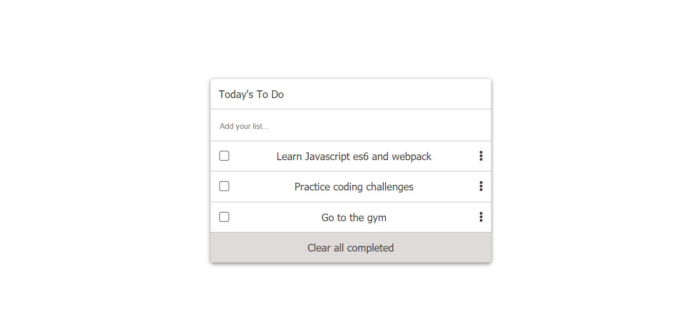

# TODO-LIST


# ToDo List Project

> This is to do list app.


Here you can write your to dos, you can check it when you complete it, also you can remove.

## Built With

- HTML
- CSS
- JS

## Live Demo

https://rawcdn.githack.com/elyor-doniyorov/TODO-LIST/7fb6e82d3dd7f550cb74447665c55e29afa5084d/dist/index.html


## Clone This Project
```
- git clone `$ https://github.com/elyor-doniyorov/TODO-LIST.git`
- cd TODO-LIST
- Type `npm install`.
- Now type `npm start`, YAY you can now see the project.
```

## Authors

👤 **Elyor Doniyorov**

- Github: [@elyor-doniyorov](https://github.com/elyor-doniyorov)
- LinkedIn: [@elyor-doniyorov](www.linkedin.com/in/elyor-doniyorov)

## 👤 **Daniel maina**

- GitHub: [@danmainah](https://github.com/danmainah)
- Twitter: [@Danmainah](https://twitter.com/dan_mainah)
- LinkedIn: [@Daniel-Maina](www.linkedin.com/in/daniel-maina-315a38191)


## 🤝 Contributing

Contributions, issues, and feature requests are welcome!

Feel free to check the [issues page](https://github.com/elyor-doniyorov/TODO-LIST/issues/2).

## Show your support

Give a ⭐️ if you like this project!